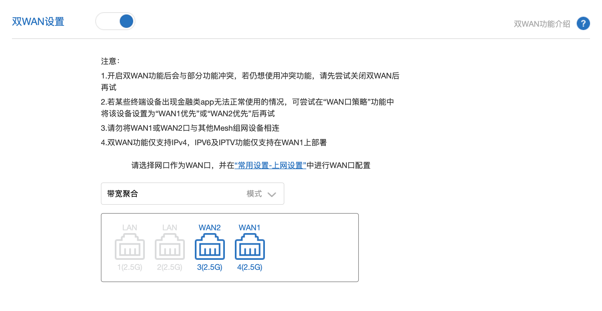
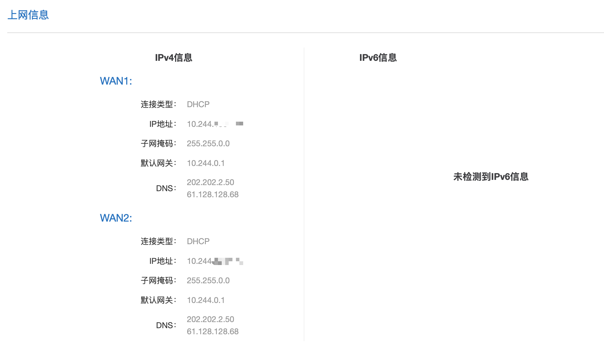
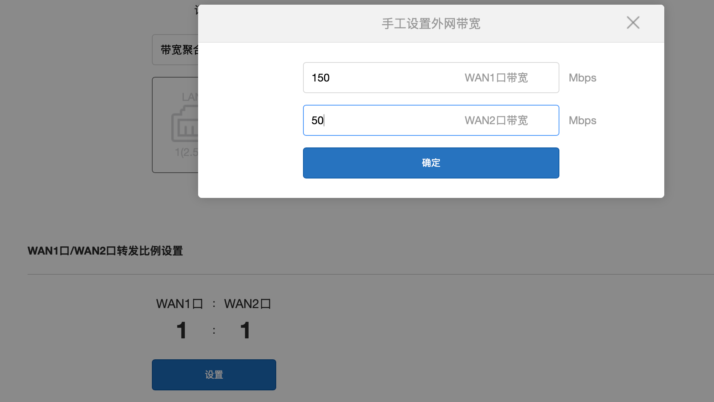
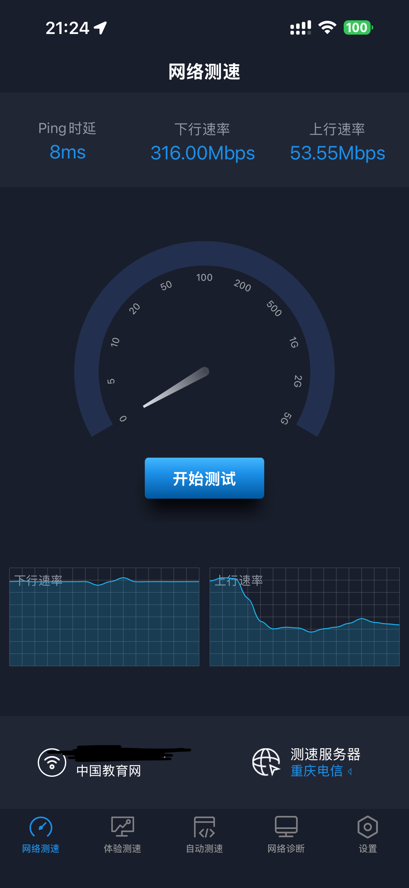

<h1 align="center">重庆大学校园网全解</h1>
<p align="center">
  论如何玩转重庆大学校园网
</p>

<p align="center">
  <a href="README_CN.md">简体中文</a> | English
</p>

---
## 1.如何实现多拨叠加网速  
众所周知,🐛的校园网目前实行3设备限制,并且即使购买69元一个月的最高档套餐,也只有200M的速度.  
一种曲线救国的方式则是,利用一个账号的多个设备限制,甚至使用多个账号,实现速度的叠加.  
> [!IMPORTANT]
> 以下配置都建立在您有软路由或可以解锁SSH的硬路由的前提下

> [!TIP]
> 与各类多线叠加的方式相同,这种方法只能对多连接起效,单连接速度仍会受到套餐限速.
---
### 1️⃣纯软件实现方法
利用macvlan和mwan3,实现单端口多拨以及负载均衡
可以[参考](https://blog.zesuy.top/2025/10/12/luciAppMultilogin/)此Blog进行配置,此处不再过多赘述

---
### 2️⃣使用交换机+小米路由器的全Web简易配置
如果你只是想要最简单的速度叠加,且不想要写任何代码,则可以使用此方法

>所需要的东西  
>1.一个交换机(最好是千兆,百兆也可以,但如果你的套餐限速大于100M,则会产生浪费)  
>2.一台支持双wan聚合的小米路由器(可以在商品介绍页或询问客服是否有此功能)

### 实现步骤  
**Step1.连线**  
若您购买的交换机有指定的上下行接口,UPLink DownLink,则上行接口接入校园网,下行的接口接入路由器任意接口  ***先只接一个***  

**Step2.登陆校园网**  
打开校园网[登陆](login.cqu.edu.cn)页面,输入你的账号密码登录  

**Step3.启用小米路由器的双wan功能**  
登陆小米路由器后台,在高级设置>网口自定义中打开双Wan设置,并且指定所需要的两个Wan口 ***必须包含第一步中的那一个接口,另一个随意***  
<div align="center">
  
</div>
<br>

**Step4.接入并登陆第二路校园网**  
接入第三步中指定的另一个Wan口至交换机,并且拔掉步骤一中的网线  
打开校园网[登陆](login.cqu.edu.cn)页面,输入你的账号密码登录  
登陆成功后,将两个Wan口都接入
<div align="center">
  
</div>
<br>

**Step5.双Wan配置**  
如果您使用的是同一个账号,则可以忽略此步,默认的1:1负载均衡没有任何问题  
如果使用的是不同账号,有不同的限速,则需要在*WAN1口/WAN2口转发比例设置*中配置两个账号的限速值
<div align="center">
  
</div>
<br>

**Step6.验证效果**  
使用多线程下载或测速验证最终效果,例如Steam,BT,PT,Speedtest等
<div align="center">
  
</div>
<br>

> [!IMPORTANT]
> 通常而言只有下行速度能够叠加,上行有很大概率无法叠加

---
### 3️⃣使用交换机+代理核心LoadBalance实现（高阶 最推荐）
不论是使用mwan3还是小米路由器双wan（其本质也是mwan3），均是基于iptables的产物  
如果想要在路由器上使用Tproxy透明代理 则会发生冲突 只能二选一  
最好的方法是直接抛弃mwan3 而改用代理核心的LoadBalance模块进行处理
> [!TIP]
> 如果你的路由器还没有部署透明代理 请[参考](https://github.com/STEVEBRMelody/MiRouter-Singbox)我的另一份教程

> [!IMPORTANT]
> 原版Singbox仍未支持LoadBalance 以下均采用[SingboxR](https://github.com/reF1nd/sing-box-releases)核心演示  
> 你需要完成 2️⃣使用交换机+小米路由器的全Web简易配置 中的所有步骤 再进行以下的配置

**Step1.获取网卡名称**  
连接路由器SSH
```
ip a
```
寻找Wan口物理网卡名称并记录

**Step2.Singbox配置文件修改**  
1.Direct outbound配置  

```
{
  "type": "direct",
  "tag": "direct0",
  "bind_interface": "eth0"
},
{
  "type": "direct",
  "tag": "direct1",
  "bind_interface": "eth1"
}
```

2.LoadBalance outbound配置  
```
{
  "type": "loadbalance",
  "tag": "balance",
  "strategy": "round-robin",

  "outbounds": [
    "direct0",
    "direct1"
  ],
  "url": "http://captive.apple.com",
  "interval": "5s",
  "interrupt_exist_connections": true
}
```

3.路由规则配置  
```
{
  "type": "shadowsocks",
  "tag": "ss-out",

  "server": "127.0.0.1",
  "server_port": 1080,
  "method": "2022-blake3-aes-128-gcm",
  "password": "8JCsPssfgS8tiRwiMlhARg=="

  "detour": "balance"
}
```
